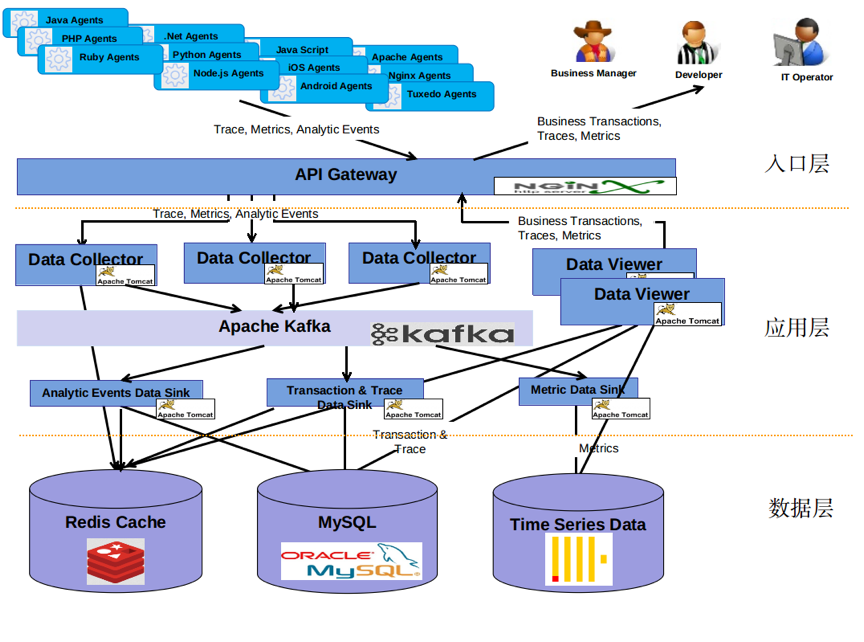

.. _installing_architecture:

===============
Architecture
===============

系统架构
--------------

流程图
--------------

系统流程图
^^^^^^^^^^^^^^
.. graphviz::

    digraph Dc {

		node [margin=0.2, fontsize=16, shape=box, style="rounded,filled", fillcolor=white]
		a [label="MobileAgent", shape="ellipse", margin=0.1]
		d [label="DataCollector", fillcolor=yellow]
		k [label="Kafka/Zookeeper"]
		r [label="Redis"]
		m [label="mysql", fillcolor=deepskyblue1]

		a -> d -> {k,r,m}
    {m, r} -> d
	}

.. graphviz::

    digraph Consumer {

  	node [margin=0.2, fontsize=16, shape=box, style="rounded,filled", fillcolor=white]
  	con [label="Consumer", fillcolor=yellow]
  	k [label="Kafka/Zookeeper"]
  	r [label="Redis"]
  	metric [label="{ ClickHouse | MetricStore }", shape=record, fillcolor=deepskyblue1]
  	m [label="mysql", fillcolor=deepskyblue1]
    osl [label="atosl", shape=box,style=filled,color=".7 .3 1.0", fillcolor=".7 .3 1.0"]

    {m,r,k,osl} -> con -> {m,k,r,metric}

  }

.. graphviz::

      digraph Consumer {
  		node [margin=0.2, fontsize=16, shape=box, style="rounded,filled", fillcolor=white]

  		dv [label="DasWeb", fillcolor=yellow]
  		r [label="Redis"]

      metric [label="{ ClickHouse | MetricStore }", shape=record, fillcolor=deepskyblue1]
  		m [label="mysql", fillcolor=deepskyblue1]

      osl [label="atosl", shape=box,style=filled,color=".7 .3 1.0", fillcolor=".7 .3 1.0"]

  		{r, m, metric, osl} -> dv
  	}

流程图详解
^^^^^^^^^^^^^^
.. uml::

    @startuml
	start
	:移动端探针上报数据;
	partition DataCollector {
		:【DataCollector】;
		if (验证数据合法性) then (true)
		    :发送数据到消息中间件 【Kafka】;
		else
			:数据直接丢弃;
		endif
	}
	partition DataConsumer {
		:【DataConsumer】 数据处理模块从【kafka】拉取数据处理;
	    if (元数据,Trace数据/App系能数据) then (元数据,Trace数据)
	       :直接写入【Mysql】数据库;
	    else
	        :格式化后回放到【Kafka】;
	        :【MetricStore】处理和消费性能数据;
	        :数据入【ClickHouse】;
	    endif

	}
	partition DasWeb {
		:从redis、mysql,MetricStore 查询数据;
	    :页面展示数据;
	}
	stop
	@enduml
