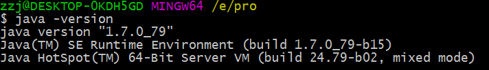
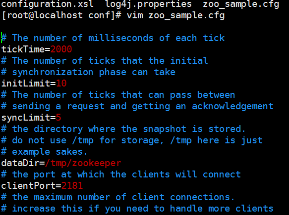
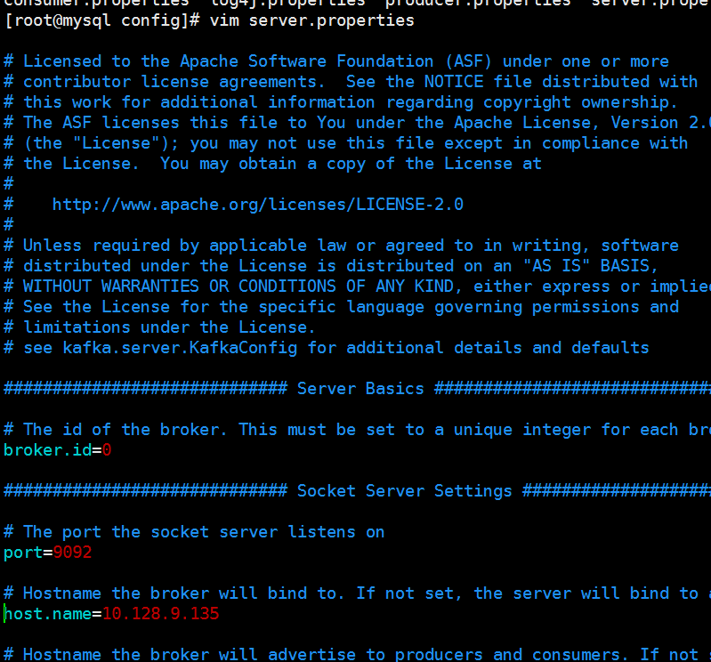

.. _installing_kafka:

==================
.. _Kafak & Zookeeper:

==================
Kafak & Zookeeper
==================
::

  请参考 http://wiki.oneapm.me/pages/viewpage.action?pageId=14325153

 

环境检测
----------- 

Kafka 安装前，确保机器上已经安装JDK7或JDK8，并正确配置环境变量JAVA_HOME检测是否已安装jdk 命令java –version ,如果如下图输出，证明已经安装jdk并且已经配置JAVA_HOME环境变量。

 
下载与解压
------------
::
 
 
  wget http://www.eu.apache.org/dist/zookeeper/zookeeper-3.4.6/zookeeper-3.4.6.tar.gz
  wget https://dist.apache.org/repos/dist/release/kafka/0.8.2.2/kafka_2.9.2-0.8.2.2.tgz
  
  tar –zxvf  zookeeper-3.4.6.tar.gz
  tar -zxvf  kafka_2.9.2-0.8.2.2.tgz
  
  
zookeeper配置
------------
.. 单机版

-   **单机版**

进入解压的zookeeper目录，进入子目录conf,会发现zoo_sample.cfg文件，这是apche官方网站提供的默认配置文件，根据配置需求修改相应配置，
并重命名zoo_sample.cfg为zoo.cfg。

配置详细  
::

  clientPort=2181       //zookeeperj监听端口
  dataDir=/data         //持久化数据存放目录
  dataLogDir=/datalog   //存放日志文件目录
  tickTime=2000         //zookeeper时间单位常量，zookeeper时间单位是多少个tick的
  syncLimit=5          //与集群配置相关选项，是指leader与follower请求应答，最多不超过5tickTime
  initLimit=10         //是指zookeeper接受客户端初始化最长时间，超过这个时间，zookeeper认为客户端连接失败
   
-  **集群版**
  
与单机版相比较，集群版还需在每一个zoo.cfg要添加一下配置,假设两台zookeeper服务组成一个集群
::
    server.1=10.128.9.134:2888:3888  //2888是集群信息交流端口，leader与followers 用这个端口建立tcp连接
    server.2=10.128.9.135:2888:3888  //3888是集群建立tcp连接选举产生leader的端口
   
   
 
zookeeper启动
-------------
zookeeper启动脚本，在bin目录下，启动命名如下
::

  ./zkServer.sh start
 
 
kafka配置
----------

-   **单机版**
进入解压的kafka目录，进入子目录config,会发现server.properties文件，这是apche官方网站提供的默认配置文件，根据配置需求修改相应配置。

配置详情
::
 
    broker.id=0                         //broker的唯一标识符
    host.name=10.128.9.135              //broker 配置的ip
    port=9092                           //broker 端口号
    advertised.host.name=10.128.9.135   //broker向zookeeper注册的名称
    advertised.port=9092                //broker向zookeeper注册端口
    zookeeper.conect=10.128.9.135:2181  //根据zookeeper安装主机IP和端口号
    delete.topic.enable=true            //配置成true topic可以被删除
    log.dirs=/tmp/log                   //kafka日志存放目录
    num.partitions=1                    //默认partitions数目
 
 
-  **集群版**
 
与单机版相比较,集群版需要修改配置
::
    broker.id=1                        //注意每一台broker服务的ID不能相同
    zookeeper。host.name=10.128.9.134:2181,10.128.9.135:2181

kafka启动
---------
kafka启动脚本，在bin目录下。deamon参数启动后自动退出日志，建议第一次启动，不带deamon参数，
查看日志是否报错，如果没有错误信息，退出，kafka进程结束，添加deamon参数启动。
::

  ./kafka-server-start.sh  [-deamon] config/server.properties

常用命令
--------
::

    单机部署
	1  查看topic列表  ./kafka-topics.sh --zookeeper localhost:2181 --list
	2  创建一个topic  ./kafka-topics.sh --create --zookeeper localhost:2181 --replication-factor 1 --partitions 4 --topic  test
	3  删除一个topic  ./kafka-topics.sh --delete --zookeeper localhost:2181  --topic test
	4  控制台producer ./kafka-console-producer.sh --broker-list localhost:9092 --topic test
	5  控制台consumer ./kafka-console-consumer.sh --zookeeper localhost:2181 --topic test

   集群部署
	1  查看topic列表  ./kafka-topics.sh --zookeeper 10.128.9.134:2181,10.128.9.135:2181/kafka --list
	2  创建一个topic  ./kafka-topics.sh --create --zookeeper 10.128.9.134:2181,10.128.9.135:2181/kafka --replication-factor 3 --partitions 4 --topic  test
	3  删除一个topic  ./kafka-topics.sh --delete --zookeeper 10.128.9.134:2181,10.128.9.135:2181/kafka  --topic test
	4  控制台producer ./kafka-console-producer.sh --broker-list 10.128.9.131:9092,10.128.9.132:9092,10.128.9.133 :9092 --topic test
	5  控制台consumer ./kafka-console-consumer.sh --zookeeper 10.128.9.134:2181,10.128.9.135:2181/kafka --topic test
